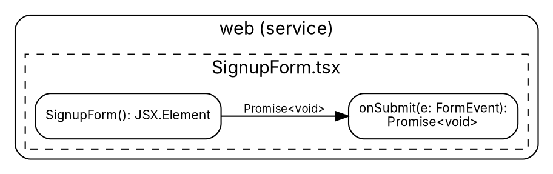
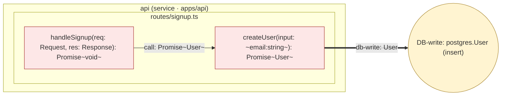
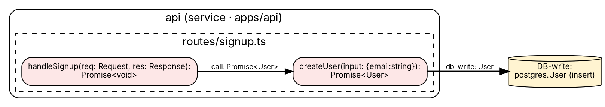

# codegraph exports — IR-to-static-format design

> Status: design draft. Aligned with `spec/ir-schema.md` v0.1.0.
> CLI surface: `packages/cli` (commander-based, see `packages/cli/package.json`).
> Companion runtime in `packages/core` (IR loader, subgraph selector) and
> `packages/viewer` (React Flow + ELK pipeline reused headless for SVG/PNG).

This document specifies five static export targets for codegraph IR
(`spec/ir-schema.md`). The viewer is the primary consumption surface, but
exports exist so users can paste a codegraph diagram into a README, a Notion
page, an ADR, an architecture deck, or a PDF. Each format trades fidelity for
ubiquity differently; this doc enumerates the trade-offs and pins down the
mapping deterministically so two runs over the same IR produce byte-identical
output.

The core pipeline is identical across formats:

```
                       ┌─────────────────────┐
   ir.json ───────────▶│ subgraph selector   │── selected IR ──▶ format
   (--root --depth     │ (root/depth/filter) │                   emitter
    --filter)          └─────────────────────┘
```

The selector is shared. The emitter is per-format. Section 1 specifies the
selector; sections 2–6 specify each emitter; section 7 walks a single 5-node
IR through all five formats side by side. Sections 8–10 cover the CLI
surface, determinism rules, and limitations.

## 1. Subgraph selection (shared by all formats)

A static export is almost never the whole graph. A real-world IR has 10⁴ to
10⁶ nodes; rendering the full set as Mermaid is unreadable and as PNG is
unrenderable. The selector trims the IR before emission.

### 1.1 Selection inputs

Three CLI flags drive selection. They compose in this order: `--root`
chooses an entry set, `--depth` bounds traversal, `--filter` removes
nodes/edges that fail predicates.

| Flag                        | Type                  | Default | Effect                                   |
|-----------------------------|-----------------------|---------|------------------------------------------|
| `--root <id>` (repeatable)  | node id (16-byte hex) | none    | seeds the BFS frontier with these nodes  |
| `--depth <n>`               | integer ≥ 0           | `∞`     | BFS hop limit from any root              |
| `--filter <expr>`           | predicate (see 1.3)   | none    | post-traversal filter applied to nodes and edges |
| `--include-parents`         | bool                  | `true`  | always include the tier ancestors of selected nodes |
| `--direction`               | `out`\|`in`\|`both`   | `out`   | which edge direction to follow during BFS |

If no `--root` is given, the selector defaults to "all `service`-tier nodes"
— this is what produces the canonical "service map" view of an unfamiliar
repo. If no `--depth` is given, traversal runs to fixpoint.

### 1.2 Traversal semantics

The traversal walks edges, not the parent-child containment tree. Edges are
followed by `category` regardless of whether source/target tiers match the
current rendering tier — a `module`-level Mermaid flowchart still uses
`call` edges between functions to *infer* module-to-module edges (see §2.1).

`--include-parents=true` is the user-friendly default: if a function node is
selected, its parent module and parent service are pulled in too, so the
emitted diagram has containment context. With `--include-parents=false` the
selector emits exactly the BFS frontier, which is useful for "show me
*just* this call chain" exports.

When `--direction=both`, edges are followed in either direction. This is
typical for "blast radius" exports: pick a node, expand 3 hops both ways,
see everything that touches it.

### 1.3 Filter expression grammar

`--filter` accepts a comma-separated list of `key=value` predicates. All
predicates must pass for a node/edge to survive. Filters apply *after*
traversal so they don't affect reachability — a node filtered out by
`category=http` still served as a hop during BFS.

Supported keys:

| Key            | Applies to | Example                       |
|----------------|------------|-------------------------------|
| `tier`         | nodes      | `tier=function`               |
| `lang`         | nodes      | `lang=ts`                     |
| `pure`         | nodes      | `pure=false`                  |
| `service`      | nodes      | `service=apps/api`            |
| `category`     | edges      | `category=call`               |
| `category!=`   | edges      | `category!=type-flow`         |
| `valueType`    | edges      | `valueType=Promise<User>`     |

Multiple values: `category=call|http-route|db-write` — the pipe is OR
within a single key. The grammar is intentionally tiny; complex selection
goes through a full query language in a later release (out of scope here).

### 1.4 The selector returns a sub-IR

Output of selection is a structurally valid IR document with the same
`schemaVersion`, a filtered `nodes`/`edges` array, and a synthetic
`metadata.selection` block recording the flags used. This means the selector
can be invoked standalone (`codegraph select`) and the result fed into any
format, including the React Flow viewer, without reimplementation.

```jsonc
{
  "schemaVersion": "0.1.0",
  "ir": {
    "metadata": {
      // ...original metadata...
      "selection": {
        "roots": ["1829304152637a8b"],
        "depth": 2,
        "direction": "out",
        "filters": ["category=call|db-write"],
        "includeParents": true,
        "selectedAt": "2026-05-08T17:31:00Z",
        "selectorVersion": "0.1.0"
      }
    },
    "nodes": [ /* trimmed */ ],
    "edges": [ /* trimmed */ ]
  }
}
```

Every emitter receives this sub-IR and never touches the full IR. Determinism
flows from this discipline: the same sub-IR maps to the same bytes in every
target format.

## 2. Mermaid

Mermaid is the lowest-friction target. It renders inline in GitHub READMEs,
Notion, GitLab, and most documentation tools without a build step. The
codegraph emitter produces two flavors of Mermaid:

- **`flowchart`** for service- and module-tier views ("how do these
  components talk to each other?")
- **`classDiagram`** for type-tier views ("what are the shapes of the
  domain objects and how do they relate?")

The emitter chooses a flavor automatically from the dominant tier in the
sub-IR (the tier with the most nodes wins; ties break toward `flowchart`),
or accepts an explicit `--mermaid-flavor flowchart|classDiagram` flag.

Reference: [Mermaid Flowchart syntax](https://mermaid.js.org/syntax/flowchart.html),
[Mermaid Class Diagram syntax](https://mermaid.js.org/syntax/classDiagram.html).

### 2.1 Flowchart mapping (service / module level)

| IR construct                         | Mermaid construct                              |
|--------------------------------------|------------------------------------------------|
| `service` node                       | `subgraph` named `svc_<8-hex-prefix>`          |
| `module` node                        | `subgraph` named `mod_<8-hex-prefix>`          |
| `function` node                      | rectangle node `fn_<8-hex>["name(): ReturnT"]` |
| `expression` leaf (literal)          | stadium `lit_<8-hex>(["\"value\""])`           |
| `expression` leaf (env / http-input) | hex `env_<8-hex>{{"X"}}`                       |
| `expression` sink (db / network / fs)| circle `snk_<8-hex>(("DB:User"))`              |
| `call` edge                          | solid arrow `-->\|"Promise<User>"\|`           |
| `import` edge                        | dotted arrow `-.->\|"import"\|`                |
| `type-flow` edge                     | thick arrow `==>\|"User"\|`                    |
| `http-route` edge                    | solid arrow with method label `\|"POST"\|`     |
| `db-read` / `db-write` edge          | solid arrow with `\|"R: User"\|` / `\|"W: User"\|` |
| `network` edge                       | solid arrow with `\|"POST /api/signup"\|`      |
| `env-read` edge                      | dashed arrow `-..->\|"env"\|`                  |

The 8-hex prefix is the first 8 chars of the BLAKE3 node id from §6 of the
IR spec. Mermaid identifiers must match `[A-Za-z_][A-Za-z0-9_]*` so we
prefix with a tier tag to avoid identifiers starting with a digit. Edge
labels are `valueType.display` from the IR — the type annotation the user
sees on the arrow is the same string the analyzer recorded.

Service and module containment renders as nested `subgraph` blocks, which
Mermaid does support for two levels (service → module). Function-tier
containment (functions inside types) is *not* rendered as nesting in a
flowchart — it would push depth to three levels and Mermaid's flowchart
layout degrades visibly past two. Instead, the function's parent type name
is appended to the function label as `Type.method()`.

### 2.2 classDiagram mapping (type level)

When the dominant tier is `type`, the emitter switches flavor:

| IR construct                         | classDiagram construct                          |
|--------------------------------------|-------------------------------------------------|
| `type` node                          | `class TypeName { ... }`                        |
| `type` node with `kind: "interface"` | `class TypeName { <<interface>> ... }`          |
| `type` node with `kind: "enum"`      | `class TypeName { <<enumeration>> ... }`        |
| `function` (method on a type)        | method line `+name(p: T): R`                    |
| field on a type                      | field line `+fieldName: T`                      |
| `import` edge                        | dependency `..>` arrow                          |
| `type-flow` edge between types       | association `-->` arrow with `valueType.display` label |
| `call` edge between methods of types | association `-->` arrow with cardinality (when both methods belong to typed receivers) |
| inheritance (when IR records `extends`/`implements`) | `<\|--` (extends) or `<\|..` (implements) |

Generic parameters use the tilde-escape: `Promise<User>` becomes
`Promise~User~` (Mermaid renders angle brackets as HTML so generics need
the workaround). Multiple generic args use the underscore form documented
in Mermaid: `Map<string, User>` → `Map~string_User~`.

### 2.3 Limitations of Mermaid

- **Edge label length.** Mermaid wraps long edge labels but doesn't
  truncate; long `valueType.display` strings (e.g.
  `Promise<{ user: User; tokens: AuthTokens }>`) overlap adjacent edges
  in dense graphs. The emitter truncates display strings to 40 chars with
  an ellipsis and emits the full string as a comment above the edge for
  searchability. The threshold is configurable via `--label-max-chars`.
- **Containment depth.** Two-level subgraph nesting works reliably;
  three-level works in recent versions but layout quality varies. The
  emitter caps containment at two levels.
- **Cross-subgraph edges.** Mermaid handles them but layout is best-effort
  and arrows often cross subgraph borders awkwardly. Expect a 50–200 node
  ceiling for visually clean output.
- **Parallel edges.** Mermaid de-duplicates edges with identical labels.
  IR allows two edges between the same pair of nodes if their categories
  differ (a `call` and a `type-flow`). The emitter combines them into a
  single edge with a `\|`-separated label (`"call: Promise<User> | flow: User"`)
  to avoid silent loss.
- **No HTML in labels.** Markdown-ish escapes in `valueType.display` (e.g.
  `<` from generics) need escaping. The emitter replaces `<` with `~` and
  documents the substitution in a header comment.
- **No styling beyond classes.** The viewer's per-node colors (effectful red,
  pure green) map to Mermaid `classDef` directives — five fixed classes:
  `pure`, `effectful`, `entry`, `leaf`, `sink`.

### 2.4 Determinism

Mermaid output is deterministic because:

1. Nodes are emitted in lexicographic order of their full hex id.
2. Edges are emitted ordered by `(sourceId, targetId, category)`.
3. The subgraph header for each container is emitted before its children.
4. Whitespace is fixed (two spaces per level, `\n` line endings).
5. The header comment includes selector flags and codegraph version, so a
   diff between two exports is dominated by genuine IR change.

## 3. D2

D2 (`d2lang.com`) is the natural fit when the diagram needs hierarchy. Its
nested-container syntax mirrors the IR's `service > module > type > function`
tiering almost one-to-one, and its layout engine handles deep nesting much
better than Mermaid. D2's edge label rendering is also less squeezed than
Mermaid's, so `valueType.display` strings render cleanly on every arrow.

Reference: [D2 Containers](https://d2lang.com/tour/containers/),
[D2 Connections](https://d2lang.com/tour/connections/).

### 3.1 Mapping

```d2
# generated by codegraph 0.1.0
# selector: --root <id> --depth 2

vars: {
  d2-config: {
    layout-engine: elk
  }
}

web: {
  shape: package
  label: "web (service)"

  SignupForm.tsx: {
    shape: page
    label: "SignupForm.tsx"

    SignupForm: {
      shape: rectangle
      label: "SignupForm(): JSX.Element"
      style.fill: "#dff5e1"   # pure
    }
    onSubmit: {
      shape: rectangle
      label: "onSubmit(e: FormEvent): Promise<void>"
      style.fill: "#fde7e7"   # effectful
    }
  }
}
```

| IR construct          | D2 construct                                            |
|-----------------------|---------------------------------------------------------|
| `service` node        | top-level container, `shape: package`                   |
| `module` node         | nested container, `shape: page`                         |
| `type` node           | nested container, `shape: class`                        |
| `function` node       | leaf, `shape: rectangle`, label `name(p: T): R`         |
| `expression` literal  | leaf, `shape: text`                                     |
| `expression` env/http | leaf, `shape: hexagon`                                  |
| `expression` sink     | leaf, `shape: cylinder` (db) / `shape: cloud` (network) |
| `call` edge           | `a -> b: "valueType.display"`                           |
| `import` edge         | `a -> b: "import" {style.stroke-dash: 3}`               |
| `type-flow` edge      | `a -> b: "T" {style.stroke-width: 2}`                   |
| `http-route` edge     | `a -> b: "POST /path" {style.stroke: "#0a7"}`           |
| `db-read`/`db-write`  | `a -> b: "R: User"` / `"W: User"`, `style.stroke` blue/red |
| `network` edge        | `a -> b: "POST /api/signup" {style.stroke: "#a30"}`     |
| `env-read` edge       | `a -> b: "env" {style.stroke-dash: 5}`                  |

D2 reserves a handful of identifiers (`vars`, `classes`, `style`, `shape`,
`label`, `direction`, `near`, `icon`). Because IR ids start with a tier tag
(`fn_`, `mod_`, etc.) the emitter never collides; bare names from the IR
(like a function literally named `style`) are quoted: `"style": { ... }`.

### 3.2 Hierarchy advantage

D2's `_.parent` syntax lets a child reference up out of its container, which
means cross-service edges (a `network` edge from `web.SignupForm.onSubmit`
to a leaf in `api.routes/signup.ts`) can be expressed as

```d2
web.SignupForm.tsx.onSubmit -> api.routes_signup_ts.handleSignup_route_literal: "POST /api/signup"
```

without breaking the container hierarchy. Mermaid does this too with
`subgraph` cross-edges, but D2's layout (with the ELK layout engine — set
via `vars.d2-config.layout-engine: elk` so codegraph's viewer and exporter
share the same engine) keeps the containers as visually coherent boxes,
which matters for architecture diagrams.

### 3.3 Limitations of D2

- **Identifier sanitization.** D2 ids permit `.` as a path separator.
  Module paths like `routes/signup.ts` must be transformed: the emitter
  replaces `/` with `__` and `.` with `_` to produce
  `routes__signup_ts`. The full original path is set as `label`, so the
  visible diagram is unaffected.
- **Large graphs are slow.** D2 ELK layout runs in seconds for 200 nodes,
  tens of seconds for 2000, and gets impractical past 5000. The emitter
  warns above 1000 selected nodes.
- **Renderer required.** Unlike Mermaid, D2 isn't rendered inline by
  GitHub. The emitter optionally ships a rendered SVG alongside the `.d2`
  source via `--with-svg`, by invoking `d2 in.d2 out.svg` if the user has
  D2 installed (no install fallback; codegraph itself never installs).
- **Parallel edges.** D2 supports them natively
  (`a -> b: "call"` and `a -> b: "flow"` co-exist), so unlike Mermaid the
  emitter does *not* merge them.
- **No semantic coloring without classes.** The emitter declares a `classes`
  block with `pure`, `effectful`, `entry`, `leaf`, `sink`, mirroring
  Mermaid for cross-format consistency.

## 4. Graphviz / DOT

DOT is the lingua franca of static graph rendering. Every CI box has
`graphviz` available, every wiki engine has a `graphviz` plugin, every
PDF/SVG toolchain in the world consumes DOT. The trade-off: DOT's layout
is purely algorithmic (no nesting hints beyond `cluster` subgraphs), so
hierarchy is approximated rather than expressed.

Reference: [Graphviz DOT Language](https://graphviz.org/doc/info/lang.html),
[Graphviz Attributes](https://graphviz.org/doc/info/attrs.html),
[Graphviz Clusters](https://graphviz.org/Gallery/directed/cluster.html).

### 4.1 Mapping



| IR construct          | DOT construct                                              |
|-----------------------|------------------------------------------------------------|
| `service` node        | `subgraph cluster_svc_<hex>` with `label`                  |
| `module` node         | `subgraph cluster_mod_<hex>` (nested cluster)              |
| `type` node           | `subgraph cluster_type_<hex>`, `style=filled, color="#eef"` |
| `function` node       | `node [shape=box, style=rounded]` with multi-line label    |
| `expression` literal  | `node [shape=note]`                                        |
| `expression` env      | `node [shape=hexagon]`                                     |
| `expression` sink     | `node [shape=cylinder]` (db) / `[shape=component]` (network) |
| `call` edge           | `a -> b [label="T", color="#333"]`                         |
| `import` edge         | `a -> b [label="import", style=dashed, color="#888"]`      |
| `type-flow` edge      | `a -> b [label="T", penwidth=2, color="#36a"]`             |
| `http-route` edge     | `a -> b [label="POST /path", color="#0a7"]`                |
| `db-read`/`db-write`  | `a -> b [label="R: User", color="#06a"]` / `color="#a06"`  |
| `network` edge        | `a -> b [label="POST /url", color="#a30", penwidth=2]`     |
| `env-read` edge       | `a -> b [label="env", style=dotted]`                       |

The cluster name *must* start with `cluster` for `dot` to draw the bounding
box. The emitter prefixes `cluster_svc_`, `cluster_mod_`, `cluster_type_`
and uses the 8-hex prefix as the unique tail.

Node labels with newlines (`\n`) split visually in DOT. The emitter uses
this for two-line function signatures:
`"createUser(input: {email: string}):\nPromise<User>"`. For more complex
table layouts (e.g. type fields), the emitter falls back to HTML labels
(`label = <<TABLE>...</TABLE>>`) — these allow per-row colors but are
heavier and harder to diff, so they're opt-in via `--dot-html-labels`.

### 4.2 Hierarchy approximation

DOT's `cluster` subgraphs only render if the layout engine is `dot` (not
`neato`, `fdp`, `sfdp`, `circo`, `twopi`). The emitter writes `dot` as the
recommended engine in a header comment. Three-level nesting
(`service > module > type`) works but cluster borders sometimes overlap
when nodes from different clusters get pulled together by edge
constraints. This is a layout artifact, not a syntax issue. The emitter
caps nesting at three levels and includes a `nodesep`/`ranksep` tuning
block in the header that scales with node count.

### 4.3 Limitations of DOT

- **No native hierarchy at the data layer.** Clusters are presentational
  only. An edge that spans clusters has no semantic difference from one
  inside a cluster — visualizers can't filter "cross-service edges" based
  on cluster alone. Codegraph encodes the IR's tier split in the cluster
  *prefix* (`cluster_svc_` vs `cluster_mod_`) so downstream tools can
  parse it back if needed.
- **Edge label collision.** DOT positions labels along edges; when many
  edges between the same cluster pair carry similar labels, they stack
  and overlap. The emitter respects `--label-max-chars` (default 32 for
  DOT, vs 40 for Mermaid).
- **No animations or interaction.** PNG/SVG only. The viewer is the place
  for hover, expand-on-click; DOT is fire-and-forget.
- **Engine sensitivity.** Same `.dot` rendered with `dot` vs `sfdp` looks
  completely different. Header comment pins the recommended engine.
- **Universal availability.** Genuinely the format's strength: every
  CI/CD pipeline, every doc-gen tool, every static site generator
  consumes DOT. When in doubt, DOT.

## 5. SVG (headless React Flow + ELK)

SVG output is the format that *looks identical* to the in-browser viewer.
The reason is straightforward: it *is* the viewer, run headless. The
viewer in `packages/viewer` already lays out the graph with React Flow +
ELK; the SVG exporter reuses that pipeline and serializes the result to
disk instead of mounting it in a browser.

### 5.1 Why headless React Flow + ELK rather than a custom SVG generator

There are two plausible architectures:

1. **Independent SVG generator.** Walk the IR and emit `<rect>`/`<line>`/
   `<text>` directly, computing layout with a standalone ELK call. This
   is what `@svgdotjs/svg.js` enables.
2. **Headless render of the actual viewer.** Boot the viewer in a headless
   browser (Puppeteer or Playwright), let React Flow + ELK do their thing,
   then serialize the rendered SVG out of the DOM.

Option 2 is recommended despite its heavier runtime cost (`puppeteer`
adds ~300 MB of Chromium):

- **Single source of layout truth.** The viewer already encodes every
  visual decision (corner radii, edge routing, label placement, color
  palette, hover-vs-static styling). A separate SVG generator would
  reimplement those decisions and immediately drift from the viewer.
- **Same ELK call.** ELK is deterministic given the same input and
  configuration, so two rendering paths *should* produce the same
  layout — but in practice React Flow wraps ELK with edge-routing
  post-processing, label collision avoidance, and a few coordinate
  rounding rules that are easier to reuse than to clone.
- **Free updates.** When the viewer adds a new node shape (say, a
  `external-api` rendered as a globe icon), SVG export gets it for free.

The cost — Chromium download — is paid only when SVG export is actually
invoked. The CLI lazy-loads `puppeteer-core` and points it at the user's
existing Chrome/Edge installation by default; falling back to bundled
Chromium only if no system browser is available.

### 5.2 The pipeline

```
sub-IR
   │
   ▼
viewer/src/layout.ts ── ELK ──▶ positioned graph
   │
   ▼
viewer/src/App.tsx (React Flow renderer)
   │
   ▼  serialized to <svg>...</svg>
puppeteer page.evaluate() ── DOM extraction ──▶ SVG string
   │
   ▼
post-process: inline fonts, strip event handlers, freeze IDs
   │
   ▼
out.svg
```

Post-processing matters for portability:

- **Inline fonts.** The viewer uses Inter; the exporter inlines a subset
  via `<style>` so the file renders correctly in tools without Inter
  installed (LibreOffice, older Word, GitHub blob view).
- **Strip event handlers.** React Flow attaches `onClick`, `onMouseEnter`
  etc. as DOM properties. They don't survive serialization but
  `data-on*` attributes can; the exporter removes any `data-*` not used
  for styling.
- **Freeze IDs.** React Flow generates random DOM ids per render. The
  exporter rewrites them to deterministic, content-addressed ids
  (`elk_<hash-of-position>`) so a re-export of the same IR produces a
  byte-identical SVG, which makes the file diffable in git.

### 5.3 Mapping

The mapping is one-to-one with what the viewer renders. Every IR node
becomes one React Flow node, and React Flow node types in the viewer are
already keyed by `tier` and (for expressions) `leaf.flavor` /
`sink.flavor`. The exporter does not maintain a separate mapping table —
that's the point of reusing the viewer.

### 5.4 Limitations of SVG

- **Heavy dependency.** Puppeteer's Chromium download is the largest
  single dep in the toolchain. The CLI guards behind a one-time prompt:
  "exporting SVG requires a headless browser; download Chromium (~300 MB)
  or point to an existing Chrome with `CODEGRAPH_CHROME_PATH`?"
- **Headless render time.** Around 2 seconds for the cold start of
  Chromium plus ~50 ms per 100 nodes for layout. A 5000-node export
  takes 10–20 seconds; a 100-node export is well under 5 seconds total.
- **Font availability.** The exporter inlines Inter (open-source) but
  cannot inline anything else due to licensing. If a user customizes
  the viewer's font, they must vouch for redistribution.
- **No interactivity.** The exported SVG is static — no hover tooltips,
  no expand/collapse. The viewer is the place for interactivity; SVG
  is a snapshot.
- **Determinism caveat.** Layout is deterministic only within a single
  ELK + React Flow version. Upgrading either may shift coordinates.
  The header comment in the SVG records ELK and React Flow versions.

### 5.5 Why not `@svgdotjs/svg.js` standalone

Considered and rejected. `svgdotjs` is excellent for hand-authored SVG,
but generating the same visuals as the viewer would require porting
~2000 lines of viewer styling, edge-routing logic, and collision
avoidance. The maintenance cost of two divergent renderers exceeds the
runtime cost of bundling Chromium. The headless approach also future-
proofs against viewer redesigns: any viewer change ships in SVG export
with no exporter changes.

A `--svg-engine svgdotjs` fallback flag is a future option for
environments where Chromium genuinely cannot run (highly locked-down
CI, certain Alpine images). For v0.1 the headless path is the only
supported route.

## 6. PNG (rasterized SVG)

PNG export is a thin wrapper over SVG export: render to SVG via the
headless pipeline, then rasterize. The rasterizer runs inside the same
Puppeteer page that produced the SVG, via `page.screenshot({ type: 'png' })`
on the React Flow viewport bounding box, so the rasterization uses
Chromium's own SVG renderer. This avoids a second SVG-renderer dep
(librsvg, resvg) and guarantees pixel-identity to what a user would see
if they screenshotted the viewer.

### 6.1 Pipeline differences from SVG

```
        SVG pipeline ─────────────────┐
                                      ▼
                                  measure viewport
                                      │
                                      ▼
                          page.screenshot({clip, omitBackground: false,
                                          type: 'png',
                                          deviceScaleFactor: --dpr})
                                      │
                                      ▼
                                    out.png
```

### 6.2 PNG-specific flags

| Flag             | Default       | Effect                                                        |
|------------------|---------------|---------------------------------------------------------------|
| `--dpr <n>`      | `2`           | device pixel ratio; `2` is "retina", `3` for very dense print |
| `--width <px>`   | `1600`        | viewport width before scaling                                 |
| `--background`   | `transparent` | `transparent` or any CSS color string                         |
| `--padding <px>` | `48`          | empty space around the diagram                                |

The default DPR of 2 is chosen because PNG is most often pasted into
Notion / Confluence / Slack, where retina-density screenshots look
crisp without ballooning file size.

### 6.3 Limitations of PNG

- **Not editable.** Unlike SVG, PNG can't be re-laid-out by the
  consumer. For docs that may need a re-export later, recommend SVG.
- **Not searchable.** Text in PNG isn't indexable; SVG text *is*. Code
  search tools and assistive tech see SVG, not PNG.
- **File size.** A 5000-node graph can produce a 5–20 MB PNG. SVG of
  the same graph is usually 200–600 KB. Recommend SVG for anything
  beyond ~500 nodes.
- **Determinism.** Pixel-identical re-runs require pinning Chromium
  major version. The header EXIF includes the version for diff hints.

## 7. Worked example: 5-node IR through all five formats

Take the smallest meaningful subgraph from the IR-spec example: the
`POST /api/signup` cross-service hop and the database write that
follows it. The selector is invoked as

```
codegraph select ir.json \
  --root 1829304152637a8b \
  --depth 2 \
  --filter category=call|http-route|db-write \
  --include-parents
```

which yields exactly five nodes (1 service, 1 module, 2 functions, 1 sink)
and four edges:

```jsonc
{
  "schemaVersion": "0.1.0",
  "ir": {
    "metadata": {
      "selection": {
        "roots": ["1829304152637a8b"],
        "depth": 2,
        "filters": ["category=call|http-route|db-write"],
        "includeParents": true
      }
    },
    "nodes": [
      { "id": "b2c3d4e5f6071829", "tier": "service", "name": "api",
        "path": "apps/api", "lang": "ts" },
      { "id": "d4e5f60718293041", "tier": "module",  "parentId": "b2c3d4e5f6071829",
        "name": "routes/signup.ts", "lang": "ts" },
      { "id": "1829304152637a8b", "tier": "function", "parentId": "d4e5f60718293041",
        "name": "handleSignup", "kind": "function", "pure": false,
        "params": [
          { "name": "req", "type": { "lang": "ts", "display": "Request",  "source": "annotated" } },
          { "name": "res", "type": { "lang": "ts", "display": "Response", "source": "annotated" } }
        ],
        "returnType": { "lang": "ts", "display": "Promise<void>", "source": "annotated" } },
      { "id": "29304152637a8b9c", "tier": "function", "parentId": "d4e5f60718293041",
        "name": "createUser", "kind": "function", "pure": false,
        "params": [
          { "name": "input", "type": { "lang": "ts", "display": "{email:string}", "source": "annotated" } }
        ],
        "returnType": { "lang": "ts", "display": "Promise<User>", "source": "annotated" } },
      { "id": "7a8b9cadbecfd0e1", "tier": "expression", "parentId": "29304152637a8b9c",
        "pure": false,
        "sink": { "flavor": "db-write", "store": "postgres", "entity": "User", "op": "insert" } }
    ],
    "edges": [
      { "sourceId": "1829304152637a8b", "targetId": "29304152637a8b9c",
        "category": "call",
        "valueType": { "lang": "ts", "display": "Promise<User>", "source": "annotated" } },
      { "sourceId": "29304152637a8b9c", "targetId": "7a8b9cadbecfd0e1",
        "category": "db-write",
        "valueType": { "lang": "ts", "display": "User", "source": "annotated" } }
    ]
  }
}
```

(Two of the four implied edges — the http-route edge to the literal and
the type-flow read of `req.body.email` — are filtered out because the
literal and http-input nodes were excluded by the category filter; what
remains is the call from handleSignup to createUser, and the db-write
sink. We also kept the parent module and service for context.)

Below: the same five nodes through every emitter.

### 7.1 Mermaid (flowchart)



Notes: angle brackets in `Promise<User>`, `Promise<void>` and
`{email:string}` are replaced with `~` per §2.3 (Mermaid renders `<` as
HTML). The double-equals arrow (`==>`) is the thick `db-write` style.

### 7.2 D2

```d2
# codegraph 0.1.0 — D2
# selection: --root 1829304152637a8b --depth 2 --filter category=call|http-route|db-write

vars: {
  d2-config: {
    layout-engine: elk
  }
}

classes: {
  pure:      { style: { fill: "#dff5e1"; stroke: "#3a8" } }
  effectful: { style: { fill: "#fde7e7"; stroke: "#a33" } }
  sink:      { style: { fill: "#fff4d1"; stroke: "#a83" } }
}

api: {
  shape: package
  label: "api (service · apps/api)"

  routes__signup_ts: {
    shape: page
    label: "routes/signup.ts"

    handleSignup: {
      shape: rectangle
      label: "handleSignup(req: Request, res: Response): Promise<void>"
      class: effectful
    }
    createUser: {
      shape: rectangle
      label: "createUser(input: {email:string}): Promise<User>"
      class: effectful
    }
  }
}

db_users_insert: {
  shape: cylinder
  label: "DB-write: postgres.User (insert)"
  class: sink
}

api.routes__signup_ts.handleSignup -> api.routes__signup_ts.createUser: "call: Promise<User>"
api.routes__signup_ts.createUser -> db_users_insert: "db-write: User" {
  style.stroke: "#a06"
  style.stroke-width: 2
}
```

Notes: `routes/signup.ts` becomes `routes__signup_ts` per §3.3
(D2-id sanitization). The cross-arrow `api.routes__signup_ts.createUser
-> db_users_insert` reaches *out* of the container to the top-level sink,
which D2 renders cleanly because the sink lives at the document root.

### 7.3 Graphviz / DOT



Notes: cluster names start with `cluster_` so `dot` draws bounding
boxes. The sink is rendered with `shape=cylinder`, mirroring D2.
Newlines in labels (`\n`) split the text across two lines for compact
nodes. `Promise<User>` renders fine in DOT — angle brackets are not
HTML in standard (non-`<TABLE>`) labels.

### 7.4 SVG (headless React Flow + ELK)

The SVG output is too long to inline (typical 5-node export: ~6 KB),
but the structure is exactly what the viewer renders, frozen to disk.
Conceptually:

```svg
<!-- codegraph 0.1.0 — SVG (headless react-flow + elk)
     selection: --root 1829304152637a8b --depth 2 --filter category=call|http-route|db-write
     elk: 0.9.x   react-flow: 11.x   chromium: 124.x -->
<svg xmlns="http://www.w3.org/2000/svg" viewBox="0 0 920 320" width="920" height="320">
  <style>
    @font-face { font-family: 'Inter'; src: url(data:font/woff2;base64,...) format('woff2'); }
    .pure       { fill: #dff5e1; stroke: #3a8; }
    .effectful  { fill: #fde7e7; stroke: #a33; }
    .sink       { fill: #fff4d1; stroke: #a83; }
    .edge-call      { stroke: #333; }
    .edge-db-write  { stroke: #a06; stroke-width: 2; }
    text        { font-family: Inter, Helvetica, sans-serif; font-size: 10px; }
  </style>

  <!-- service container -->
  <g id="elk_svc_b2c3d4e5" transform="translate(20,20)">
    <rect width="780" height="180" rx="8" fill="none" stroke="#888"
          stroke-dasharray="4 4"/>
    <text x="12" y="-6">api (service · apps/api)</text>

    <!-- module container -->
    <g id="elk_mod_d4e5f607" transform="translate(16,28)">
      <rect width="748" height="140" rx="6" fill="none" stroke="#aaa"
            stroke-dasharray="2 2"/>
      <text x="12" y="-4">routes/signup.ts</text>

      <!-- handleSignup -->
      <g id="elk_fn_18293041" transform="translate(24,28)">
        <rect width="320" height="44" rx="6" class="effectful"/>
        <text x="16" y="18">handleSignup(req: Request, res: Response):</text>
        <text x="16" y="34">Promise&lt;void&gt;</text>
      </g>

      <!-- createUser -->
      <g id="elk_fn_29304152" transform="translate(404,28)">
        <rect width="320" height="44" rx="6" class="effectful"/>
        <text x="16" y="18">createUser(input: {email:string}):</text>
        <text x="16" y="34">Promise&lt;User&gt;</text>
      </g>
    </g>
  </g>

  <!-- sink (outside the service cluster) -->
  <g id="elk_snk_7a8b9cad" transform="translate(840,80)">
    <ellipse cx="40" cy="22" rx="40" ry="22" class="sink"/>
    <text x="14" y="20">DB-write:</text>
    <text x="6" y="34">postgres.User (insert)</text>
  </g>

  <!-- edges (ELK-routed orthogonal paths) -->
  <path d="M 388,72 L 444,72" class="edge-call"  marker-end="url(#arrow)"/>
  <text x="396" y="64">call: Promise&lt;User&gt;</text>

  <path d="M 768,72 L 840,90" class="edge-db-write" marker-end="url(#arrow)"/>
  <text x="780" y="80">db-write: User</text>

  <defs>
    <marker id="arrow" viewBox="0 0 10 10" refX="9" refY="5"
            markerWidth="6" markerHeight="6" orient="auto-start-reverse">
      <path d="M 0 0 L 10 5 L 0 10 z" fill="#333"/>
    </marker>
  </defs>
</svg>
```

The actual exporter output would inline the full Inter font subset,
deterministically hash element ids (`elk_<hash>`), and strip the
dev-only attributes React Flow attaches. The viewBox is computed from
the ELK layout's bounding box plus `--padding`.

### 7.5 PNG

The PNG output is a screenshot of the same SVG above, rendered by
Chromium at `--dpr 2` on a 1600px viewport, then cropped to the
viewport bounding box plus 48 px padding. Visually it matches the
SVG exactly because both come from the same DOM. File size for this
5-node example: ~24 KB at DPR 2, ~52 KB at DPR 3.

(Inlining a PNG byte sequence is not informative; what matters is the
generation contract: the PNG is a `page.screenshot()` over the same
DOM that produced the SVG, so per-pixel parity with the viewer is the
guarantee.)

### 7.6 Side-by-side trade-offs (for this 5-node example)

| Format    | File size | Render env required             | Editable | Searchable text | Pastes inline in GitHub README |
|-----------|-----------|---------------------------------|----------|------------------|--------------------------------|
| Mermaid   | ~600 B    | none (native in markdown)       | yes      | yes              | yes                            |
| D2        | ~700 B    | `d2` CLI to render to SVG       | yes      | yes (via SVG)    | no (renders only after build)  |
| DOT       | ~900 B    | `graphviz` to render            | yes      | yes (via SVG)    | yes (with action / plugin)     |
| SVG       | ~6 KB     | none to consume; Chromium to *produce* | no  | yes              | yes (img tag)                  |
| PNG       | ~24 KB    | none to consume; Chromium to produce  | no   | no               | yes                            |

Recommendation defaults baked into the CLI:

- **README.md / GitHub issue** → Mermaid
- **Architecture docs / ADR** → D2 (best hierarchy) or DOT (best ubiquity)
- **Slide deck / Notion / Confluence** → PNG
- **Embed in another HTML doc, want re-flowable** → SVG
- **CI artifact for diffing across PRs** → DOT or SVG (deterministic text)

## 8. CLI surface

```
codegraph export <format> [<ir.json>] [options]

Positional:
  format              one of: mermaid | d2 | dot | svg | png
  ir.json             path to IR; defaults to ./codegraph.json or stdin if absent

Selection (shared with `codegraph select`):
  --root <id>         repeatable; node id (16-byte hex prefix accepted if unambiguous)
  --depth <n>         BFS hop limit; default ∞
  --direction <dir>   out|in|both (default: out)
  --filter <expr>     comma-separated key=value list
  --include-parents   default: true; --no-include-parents to disable

Output:
  --out <path>        output file; defaults to ./codegraph.<ext>; "-" for stdout
                      (mermaid|d2|dot only; svg/png cannot stream)
  --label-max-chars <n>  truncate edge labels (default: format-specific)

Format-specific:
  --mermaid-flavor <flowchart|classDiagram>
  --dot-engine <dot|sfdp|fdp|neato|circo|twopi>     (recommended only)
  --dot-html-labels                                  (record-shape tables for types)
  --svg-no-fonts                                     (skip font inlining; smaller, less portable)
  --dpr <n>                                          (PNG only; default 2)
  --width <px>                                       (SVG/PNG viewport; default 1600)
  --background <css>                                 (SVG/PNG; default transparent)
  --padding <px>                                     (SVG/PNG; default 48)

Determinism:
  --no-timestamp      omit generation timestamp from header comment
  --no-version        omit codegraph version from header comment
                      (use both flags for reproducible builds / golden diffs)
```

Examples:

```bash
# Quickest path: full IR to a Mermaid block on stdout
codegraph export mermaid

# Module-level architecture diagram, two services deep
codegraph export d2 ir.json \
  --root b2c3d4e5f6071829 --root a1b2c3d4e5f60718 \
  --depth 3 \
  --filter tier=service|module,category=call|network|http-route \
  --out architecture.d2

# Blast radius PNG for a sensitive function
codegraph export png ir.json \
  --root 1829304152637a8b --direction both --depth 4 \
  --dpr 3 --background "#fff" \
  --out blast-radius-handleSignup.png

# Type-tier class diagram for the domain model
codegraph export mermaid \
  --filter tier=type,category=type-flow|import \
  --mermaid-flavor classDiagram \
  --out docs/domain-model.mmd
```

## 9. Determinism & golden tests

Every emitter is bound by:

1. **Stable iteration.** Nodes and edges are sorted by id before emission.
2. **No environment leakage.** No `process.cwd()`, hostname, or
   `os.userInfo()` ever lands in output.
3. **Optional timestamps.** Header comments include `generatedAt` by
   default; `--no-timestamp` suppresses it. Tests run with `--no-timestamp`.
4. **Pinned versions.** SVG/PNG headers record `elk` + `react-flow` +
   `chromium` versions. A version bump shifts pixels; tests pin all three.
5. **Golden corpus.** `test-fixtures/exports/` holds the expected output
   for the §7 worked example in all five formats. Any emitter change
   must update the goldens; CI diffs the generated output against them
   and fails on drift.

Determinism matters most for SVG/PNG because they're the formats most
likely to land in PR review. A reviewer who sees a 50 KB SVG diff for an
unrelated PR will tune out; the discipline above keeps SVG diffs
proportional to actual graph change.

## 10. Limitations summary (cross-format)

| Concern                      | Mermaid   | D2     | DOT    | SVG    | PNG    |
|------------------------------|-----------|--------|--------|--------|--------|
| Hierarchy depth              | 2 levels  | unbounded | 3 levels (degraded) | unbounded | unbounded |
| Edge label fidelity          | truncated | full   | full   | full   | full   |
| Parallel edges               | merged    | preserved | preserved | preserved | preserved |
| Cross-cluster edges          | yes (best-effort) | yes (clean) | yes (clean) | yes | yes |
| Inline rendering on GitHub   | yes       | no     | no     | yes    | yes    |
| Editable after export        | yes       | yes    | yes    | yes    | no     |
| Searchable text              | yes       | yes (via SVG) | yes (via SVG) | yes    | no     |
| Layout determinism           | by Mermaid version | by D2/ELK version | by Graphviz version | by ELK + RF version | by Chromium + ELK + RF version |
| Heavy runtime dep            | none      | `d2` CLI optional | `graphviz` optional | Chromium | Chromium |
| Recommended graph size       | ≤ 200     | ≤ 1000 | ≤ 5000 | ≤ 5000 | ≤ 1000 |

## 11. Open questions / future work

- **Mermaid `architectureDiagram`** is a candidate flavor for a third
  Mermaid mode at the service tier; it ships with explicit cloud-icon
  glyphs. Worth re-evaluating after adoption stabilizes.
- **Excalidraw export.** Some teams prefer Excalidraw scenes for ADR
  embedding. Not in v0.1; the JSON shape is documented and stable.
- **PlantUML.** Strictly less expressive than D2 for our hierarchy needs
  but ubiquitous in Java shops. Add only if user demand materializes.
- **Animated SVG diff.** Two IR snapshots → one SVG with state toggles
  (cross-fade between snapshots). The diff layer (out of scope here)
  is a prerequisite.
- **`--svg-engine svgdotjs` no-Chromium fallback.** Useful for highly
  constrained CI; design exists, implementation deferred until at
  least one user asks.

---

Sources for this design:

- Mermaid flowchart syntax: [Flowcharts | Mermaid](https://mermaid.js.org/syntax/flowchart.html)
- Mermaid class diagram syntax: [Class diagrams | Mermaid](https://mermaid.js.org/syntax/classDiagram.html)
- D2 containers and edge syntax: [Containers | D2 Documentation](https://d2lang.com/tour/containers/)
- D2 connections: [Connections | D2 Documentation](https://d2lang.com/tour/connections/)
- Graphviz DOT language: [DOT Language | Graphviz](https://graphviz.org/doc/info/lang.html)
- Graphviz attributes: [Attributes | Graphviz](https://graphviz.org/doc/info/attrs.html)
- Graphviz clusters: [Clusters | Graphviz](https://graphviz.org/Gallery/directed/cluster.html)
